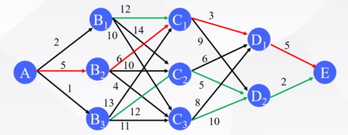

# 动态规划(Dynamic Programming, DP)

使用Matlab演示动态规划算法  

## 算法思路

逆向寻优，正向求解(与递归算法有相似之处)  

DP算法本质上由三层循环构成：

- 第一层 逆向遍历每个阶段
- 第二层 遍历第i阶段的每个状态
- 第三层 对于第i阶段的第j状态，遍历第i+1阶段的每个状态，

## 参考

1. https://www.bilibili.com/video/BV1ST4y1T7Eh/?spm_id_from=333.788.recommend_more_video.-1&vd_source=be5bd51fafff7d21180e251563899e5e

## 文件说明

DP.m 代码演示